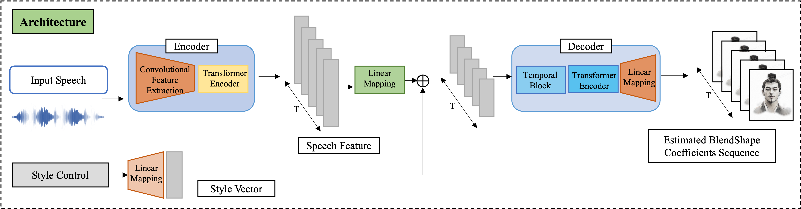
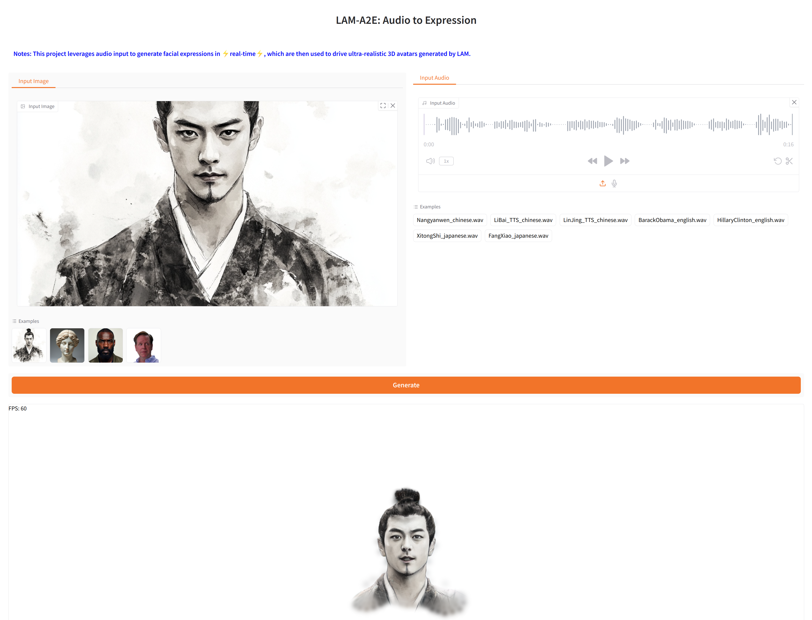

# LAM-A2E: Audio to Expression

[](https://aigc3d.github.io/projects/LAM/) 
[](https://www.apache.org/licenses/LICENSE-2.0)
[](https://www.modelscope.cn/studios/Damo_XR_Lab/LAM-A2E) 

## Description
#### This project leverages audio input to generate ARKit blendshapes-driven facial expressions in ⚡real-time⚡, powering ultra-realistic 3D avatars generated by [LAM](https://github.com/aigc3d/LAM). 
To enable ARKit-driven animation of the LAM model, we adapted ARKit blendshapes to align with FLAME's facial topology through manual customization. The LAM-A2E network follows an encoder-decoder architecture, as shown below. We adopt the state-of-the-art pre-trained speech model Wav2Vec for the audio encoder. The features extracted from the raw audio waveform are combined with style features and fed into the decoder, which outputs stylized blendshape coefficients. 

<div align="center">

</div>

## Demo

<div align="center">
  <video controls src="https://github.com/user-attachments/assets/a89a0d70-a573-4d61-91bd-4f09a0b6ce2c">
  </video>
</div>

## 📢 News

**[May 21, 2025]** We have released a [Avatar Export Feature](https://www.modelscope.cn/studios/Damo_XR_Lab/LAM_Large_Avatar_Model), enabling users to generate facial expressions from audio using any [LAM-generated](https://github.com/aigc3d/LAM) 3D digital humans.  <br>
**[April 21, 2025]** We have released the [ModelScope](https://www.modelscope.cn/studios/Damo_XR_Lab/LAM-A2E) Space ! <br>
**[April 21, 2025]** We have released the WebGL Interactive Chatting Avatar SDK on [OpenAvatarChat](https://github.com/HumanAIGC-Engineering/OpenAvatarChat) (including LLM, ASR, TTS, Avatar), with which you can freely chat with our generated 3D Digital Human ! 🔥 <br>

### To do list
- [ ] Release Huggingface space.
- [x] Release Modelscope space.
- [ ] Release the LAM-A2E model based on the Flame expression.
- [x] Release Interactive Chatting Avatar SDK with [OpenAvatarChat](https://www.modelscope.cn/studios/Damo_XR_Lab/LAM-A2E), including LLM, ASR, TTS, LAM-Avatars.


## 🚀 Get Started
### Environment Setup
```bash
git clone git@github.com:aigc3d/LAM_Audio2Expression.git
cd LAM_Audio2Expression
# Create conda environment (currently only supports Python 3.10)
conda create -n lam_a2e python=3.10
# Activate the conda environment
conda activate lam_a2e
# Install with Cuda 12.1
sh  ./scripts/install/install_cu121.sh
# Or Install with Cuda 11.8
sh ./scripts/install/install_cu118.sh
```


### Download

```
# HuggingFace download
# Download Assets and Model Weights
huggingface-cli download 3DAIGC/LAM_audio2exp --local-dir ./
tar -xzvf LAM_audio2exp_assets.tar && rm -f LAM_audio2exp_assets.tar
tar -xzvf LAM_audio2exp_streaming.tar && rm -f LAM_audio2exp_streaming.tar

# Or OSS Download (In case of HuggingFace download failing)
# Download Assets
wget https://virutalbuy-public.oss-cn-hangzhou.aliyuncs.com/share/aigc3d/data/LAM/LAM_audio2exp_assets.tar
tar -xzvf LAM_audio2exp_assets.tar && rm -f LAM_audio2exp_assets.tar
# Download Model Weights
wget https://virutalbuy-public.oss-cn-hangzhou.aliyuncs.com/share/aigc3d/data/LAM/LAM_audio2exp_streaming.tar
tar -xzvf LAM_audio2exp_streaming.tar && rm -f LAM_audio2exp_streaming.tar

Or Modelscope Download
git clone https://www.modelscope.cn/Damo_XR_Lab/LAM_audio2exp.git ./modelscope_download
```


### Quick Start Guide
#### Using <a href="https://github.com/gradio-app/gradio">Gradio</a> Interface: 
We provide a simple Gradio demo with **WebGL Render**, and you can get rendering results by uploading audio in seconds.

[//]: # ()
<div align="center">
  <video controls src="https://github.com/user-attachments/assets/2bb4e74f-cd96-4c50-9833-fae10b1ead4c
">
  </video>
</div>


```
python app_lam_audio2exp.py
```

### Inference
```bash
# example: python inference.py --config-file configs/lam_audio2exp_config_streaming.py --options save_path=exp/audio2exp weight=pretrained_models/lam_audio2exp_streaming.tar audio_input=./assets/sample_audio/BarackObama_english.wav
python inference.py --config-file ${CONFIG_PATH} --options save_path=${SAVE_PATH} weight=${CHECKPOINT_PATH} audio_input=${AUDIO_INPUT}
```

### Acknowledgement
This work is built on many amazing research works and open-source projects:
- [FLAME](https://flame.is.tue.mpg.de)
- [FaceFormer](https://github.com/EvelynFan/FaceFormer)
- [Meshtalk](https://github.com/facebookresearch/meshtalk)
- [Unitalker](https://github.com/X-niper/UniTalker)
- [Pointcept](https://github.com/Pointcept/Pointcept)

Thanks for their excellent works and great contribution.


### Related Works
Welcome to follow our other interesting works:
- [LAM](https://github.com/aigc3d/LAM)
- [LHM](https://github.com/aigc3d/LHM)


### Citation
```
@inproceedings{he2025LAM,
  title={LAM: Large Avatar Model for One-shot Animatable Gaussian Head},
  author={
    Yisheng He and Xiaodong Gu and Xiaodan Ye and Chao Xu and Zhengyi Zhao and Yuan Dong and Weihao Yuan and Zilong Dong and Liefeng Bo
  },
  booktitle={arXiv preprint arXiv:2502.17796},
  year={2025}
}
```
